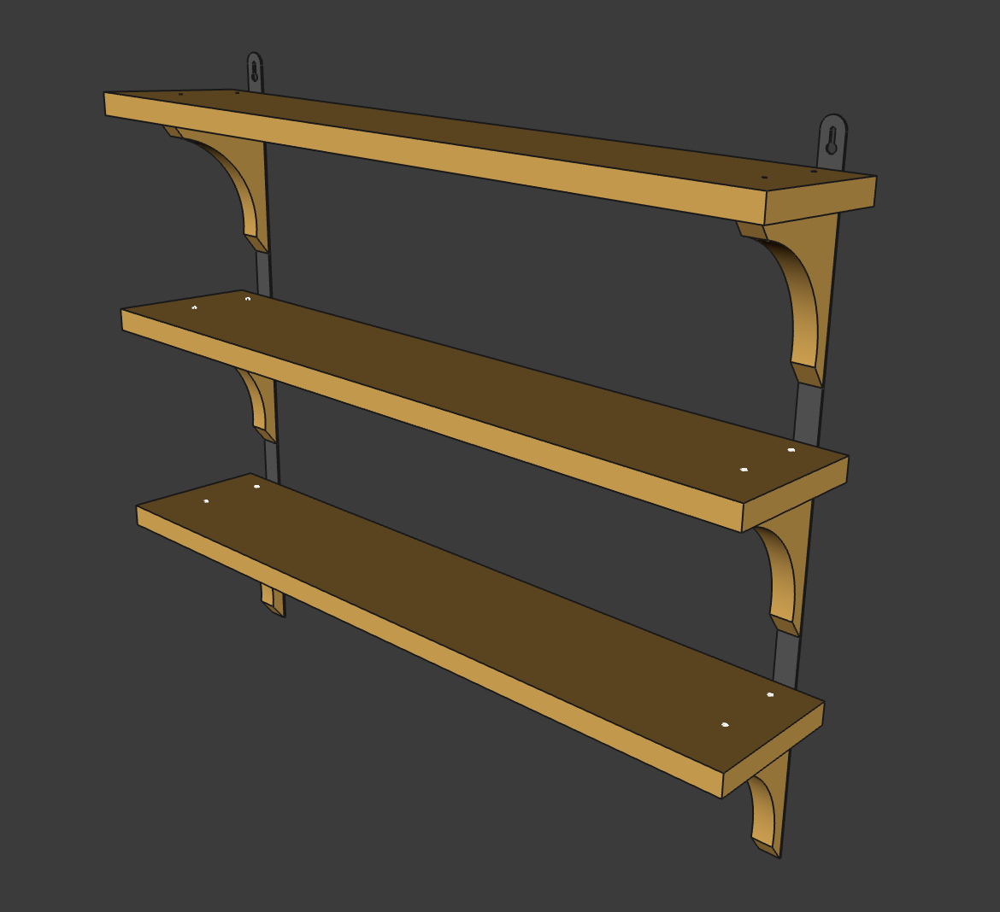

# shelf

## Details
Whole shelf model is fully parametric and uses minimum materials for maximum
comfort and assembly simplicity.

My implementation of the model features hand planed and angle-grinder-sanded
half-rotten pine planks covered in four layers of acrylic "oak" paint. Planks
had some 6-10mm scabies holes that were patched with plaster filler.

Model was made in 2 evenings, manufacturing took 7 days in total, 3 of which
were dedicated to watching paint dry.

## Imagery
### Assembly finished

### Bug holes patched

### First paint layer

### Third paint layer

